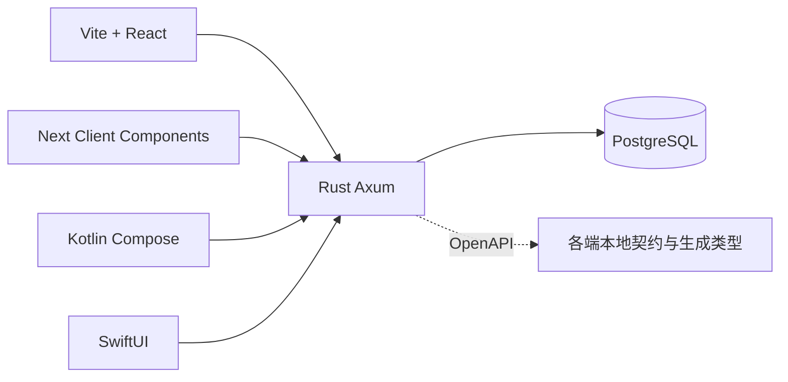

# v0.1.0 技术架构

状态：基础实现已通过历史验收；当前 JWT 登录改造正在验收；2026-10-05 审查整理。范围与接口以 [需求](requirements.md) 为准。

## 工程与职责

五个目录分别是独立产品工程，各自维护 `.gitignore`。SPA / Next 用各自 npm、package.json、package-lock.json、Node 声明、生成器、语言资源与工具配置；backend 用 Cargo；Android 用 Gradle Wrapper；iOS 用 XcodeGen / CocoaPods / Xcode 原生包解析。根目录没有 JS package、共享源码包或统一 JS 构建图。

Rust 负责身份映射、校验、授权、事务和业务。Next 公共页面用 Server Components / locale Metadata；登录后界面用 Client Components 直接请求 Rust，不持有服务端私有会话或数据库连接。跨账户切换清除 Query cache，私有响应禁止公共缓存。

各端目录按职责建立必要模块，不预建多层 service / repository 框架。backend 保持 `api / domain / platform`；Web 包含 auth、items、API、locales；原生把认证、存储、网络与 UI 状态分离。各端 README / AGENTS 包含单独复制后的操作说明。

## 生态与兼容性

| 层              | 采用方案                                                          | 原因                                                                      |
| --------------- | ----------------------------------------------------------------- | ------------------------------------------------------------------------- |
| Web             | Node 24、TypeScript 6、React 19；Vite 8 / Next 16                 | 当前稳定兼容系列；具体 patch 由实际安装和编译锁定                         |
| Web 契约        | Hey API openapi-ts，生成 TypeScript DTO / fetch SDK               | 当前 openapi-typescript peer 仅 TS5；Hey API 支持 TS6，避免忽略 peer 冲突 |
| Web 状态 / 认证 | TanStack Query、原生 fetch / JWT 会话连接器                       | 成熟查询；access 内存、sessionStorage refresh                             |
| Web 多语言      | react-i18next / next-intl                                         | 各自框架原生集成，catalog 不跨项目引用                                    |
| Web UI          | 语义 HTML、CSS、必要图标与 React 表单                             | 极小 CRUD 不预装组件全集；单一绿色强调、平静列表、明确焦点                |
| API             | Rust 1.99、Axum 0.8、Tokio、SQLx 0.8、PostgreSQL 16               | 固定兼容工具链，动态参数化 SQL 与显式迁移                                 |
| API 契约 / JWT  | utoipa、jsonwebtoken、Argon2id                                    | 元数据导出、成熟 JWT 签名与密码散列；必要会话存储                         |
| Android         | Kotlin、Compose / Material 3、ViewModel、StateFlow、Tink Keystore | minSdk 34，原生 dev/prod flavors                                          |
| Android 契约    | OpenAPI Generator kotlin / jvm-retrofit2                          | 生成模型 / suspend API，OkHttp，明确序列化依赖                            |
| iOS             | Swift 6、SwiftUI、Observation、Keychain                           | iOS 18；应用内密码登录与 Keychain                                         |
| iOS 契约        | Apple Swift OpenAPI Generator / Runtime / URLSession              | 本地 package、Xcode 原生解析与 build plugin，无额外手动生成命令           |
| 验证            | Cargo、Playwright、Gradle / instrumented tests、XCTest / XCUITest | 全部本地执行，以真实服务验证关键路径                                      |

UI 视觉定位：轻量纸面式任务列表，克制留白和细分隔线，主要操作使用单一强调色。内容层次：应用与偏好、身份操作、创建输入、任务列表和分页。动效仅用于提交状态与焦点反馈，尊重 reduced-motion，不添加装饰性首屏或产品无关说明。

## OpenAPI 与数据

Rust DTO 和路由元信息是权威来源，离线导出 JSON 到 `docs/contracts/openapi.json`。选择 JSON 以减少 YAML 转换依赖，仍是标准 OpenAPI 3.1。各客户端保留本地副本；独立构建只读取本端输入。生成器固定版本，生成代码不手改。根同步脚本只复制和调用本端命令；检查模式导出到临时目录并比对，不能静默更新源码。

表 `identities`：UUID、issuer、subject、时间，唯一 `(issuer, subject)`。表 `items`：UUID、owner_id FK、title、completed、version、时间；索引 `(owner_id, created_at DESC, id DESC)`。数据库也检查 title 字节与版本约束。更新和删除用事务行锁，owner 查询在版本检查前执行。分页以 repeatable read 事务读取 total 和 items。

迁移通过独立 Cargo 二进制执行；API 启动不自动改 schema。时间序列化固定毫秒和 Z；DTO 约束和完整状态码进入规范，真实服务测试验证 schema 与行为一致。

## JWT 认证与网络

所有客户端在应用内提交用户名密码到 Rust。后端用 Argon2id 校验，jsonwebtoken 签发 HS256 access JWT，15 分钟有效，固定 issuer / audience，包含用户 UUID 与会话 UUID。私有请求验证签名、期限和数据库会话，不需要外部发现或公钥服务。

accounts 以 identity UUID 为主键，保存唯一 username 和 password_hash；auth_sessions 保存 account_id、refresh_hash、expires_at、revoked_at。原 identity / Item 外键保留，追加迁移不清空历史数据。随机 refresh token 只存 SHA-256 散列，30 天绝对期限；原子 UPDATE 轮换，并发旧 token 只有一个成功。logout 撤销当前会话，JWT 即时失效。

Web access token 在内存，refresh token 在 sessionStorage；原生 refresh token 在 Tink Keystore / Keychain。恢复与续期串行执行，退出后迟到结果不能回填旧用户，缓存按 user.id 隔离。登录表单只含用户名、密码、登录和必要错误，保持双语、主题与无障碍。

开发 API 为 `http://localhost:8080`；Android Emulator 执行 adb reverse tcp:8080 tcp:8080。客户端只配置 API URL，没有认证 callback / deep link。生产使用 HTTPS，本地 HTTP 例外仅 dev Debug 与 localhost / 127.0.0.1。

## 配置与部署

各工程提供本地配置样例及必填检查。后端数据库凭证不会进入客户端，客户端 API URL 为公开值，JWT_SECRET 仅在后端。开发依赖使用原生 PostgreSQL；数据库创建、账号创建与启动命令见 backend 的 README，不能修改用户现有数据库服务。

默认端口：SPA 5173、Next 3000、API 8080、PostgreSQL 5432；SPA 原生 Nginx 示例监听8088。开发 Web 代理 `/api` 到 API；生产静态服务优先处理 `/api` 再做 SPA fallback。Next 使用 standalone Node 输出；Rust 交付 release API / migrate 二进制。实际生产域名、证书与签名由部署者配置。

移动环境完整规范见 [双环境](mobile-environments.md)。环境与构建模式分开；切换 iOS 环境重建同名工程，再运行 pod install。官方 Swift 包在 Xcode 构建时解析，不要求 Python 包装或额外工程生成步骤。

## AI 开发与验证

根 / 分端 AGENTS 记录模块、原生命令和禁止项；CLAUDE.md 引用公共规则。文档模板包含输入输出、边界、验收命令与证据。运行任务先读本端上下文，再小步实现、更新契约和真实验证。无必要不加层、不加依赖、不加测试框架；稳定转换与高风险隔离 / 并发必须验证。

临时产物和日志在 `.codex`。缺工具或某项未运行要如实报告，不能把上一阶段的通过结果用于未实现的应用。发布门禁见 [交付计划](delivery-plan.md)。
